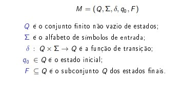

# Autômatos

## Autômatos Finitos Determinísticos

### O que é ?

#### Modelo matemático

#### Utilizado para reconhecer uma linguagem

#### Modela uma máquina simples

#### Possui entradas e saídas finitas

    Entrada: Determinada sequência de simbolos do alfabeto.
    Saída: estados que devem ser predefinidos.

#### por que é pré definido ?

    Não possui memória auxiliar
    Informação "memorizada" por cada estado

### Tipos:

#### Determinísticos

    Estado corrente + simbolo de entrada: estado resultante único.

#### Não Determinísticos

    Estado corrente + simbolo de entrada: estado resultante pertencente a um conjunto de estados alternativos.

    Estado corrente + nenhum simbolo de entrada: estado resultante pertencente a um conjunto de estados alternativos.

### É formado basicamente por 3 partes

#### Entrada

    Informação a ser processada.

#### Controle

    Reflete o estado corrente da máquina

#### Função de transição

    Determina a transição de estado conforme estado corrente e simbolo de entrada lido.

### Definição Formal:

### Função de transição estendida

### Um  automato finito sempre termina, não existe loop infinito.

#### Aceita

    Processa a palavra inteira e chega a um estado final.

#### Rejeita

   Processa a palavra inteira e não chega a um estado final.
   
  Função indefinida para argumento(estado e simbolo)

## Autômoto Finito e Não Determinístico 

    Agora podemos ter uma transição épsilon. Ou seja, podemos mudar de estado sem ler algo.

    Muito similar ao conceito de threads.

