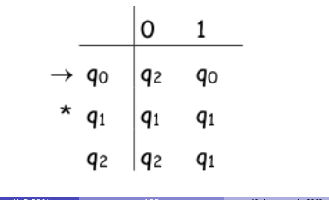
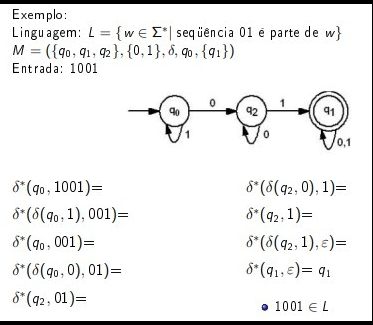

# Autômatos

## Autômatos Finitos Determinísticos

### O que é ?

- Modelo matemático

-  Utilizado para reconhecer uma linguagem

-  Modela uma máquina simples

-  São dispositivos de reconhecimento de uma linguagem.

-  São modelos computacionais com quantidade limitada (finita) de memória;

-  Também são chamadas de "Máquinas de estado finito";

- Em geral são representados em um diagrama de estados.

- Ele lê um estado por vez e não volta atrás nas decisões.

#### Possui entradas e saídas finitas

- Entrada: Determinada sequência de simbolos do alfabeto. Possuímos uma ÚNICA entrada que é indicada com uma seta que vem de nenhum outro estado.

- Saída: estados que devem ser predefinidos. São indicados com círculos duplos e podemos ter mais de um.

#### por que é pré definido ?

- Não possui memória auxiliar;

- Informação "memorizada" por cada estado

### Tipos:

#### Determinísticos

- Estado corrente + simbolo de entrada: estado resultante único.

- Para cada simbolo do alfabeto existe exatatamente um estado para qual o autômato pode transitar a partir do único estado ativo

#### Não Determinísticos

- Estado corrente + simbolo de entrada: estado resultante pertencente a um conjunto de estados alternativos.

- Estado corrente + nenhum simbolo de entrada: estado resultante pertencente a um conjunto de estados alternativos.

### É formado basicamente por 3 partes

#### Entrada

- Informação a ser processada.

#### Controle

- Reflete o estado corrente da máquina

#### Função de transição

- Determina a transição de estado conforme estado corrente e simbolo de entrada lido.

### Definição Formal:

### Função de transição estendida

### Um  automato finito sempre termina, não existe loop infinito.

#### Aceita

- Processa a palavra inteira e chega a um estado final.

- Dizemos que aceita uma cadeia, se e somente se ao iniciarmos dado um estado inicial conseguirmos chegar um estado final durante o processamento.

#### Rejeita

- Processa a palavra inteira e não chega a um estado final.
   
- Função indefinida para argumento(estado e simbolo)
