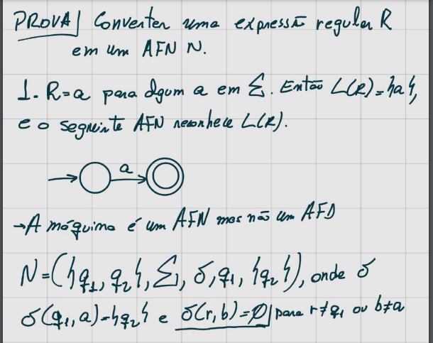
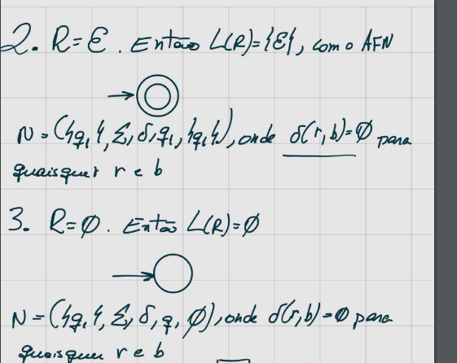
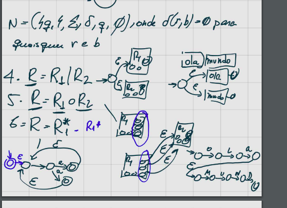
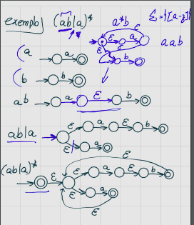

# Expressões Regulares

 - Atuam como especie de ```máscaras``` para expressões. Custam muito caro. Porém, são muito utéis.

## Caracteres especiais em expressões regulares


### .
    qualquer caracter

### ^ 
    Inicio de linha

### $   
    Fim da linha

###     \ <  
    Início de uma palavra
    
### \ >
       Final de uma palavra

### \
    Escape

### *
    Zero ou mais do caracter anterior

### ?
    Zero ou 1 do caracter anterior

### +
    1 ou mais

### ( )
    Indica um grupo

### | 
    Indica o "ou"

Utilize o link a seguir para estudar com mais detalhes e visualizar exemplos: [Link](https://www.devmedia.com.br/iniciando-expressoes-regulares/6557)

## Comando "grep"

    Serve para fazer  buscas em arquivos utilizando expressões regulares.

### Exemplo - Máscara de CPF

    grep -E '\<([0-9]{3}\.){2}[0-9]{3}-[0-9]{2}\>

### Expressão regular para verificar se um número é Par.

    grep -E '[02468]\>


### Expressão regular para verificar se um número é Impar.

    grep -E '[^02468]\>

## Equivalência REGEX com AF

- Uma linguagem é regular se e somente se alguma expressão regular a descreve.


- Se uma linguagem é descrita por uma expressão regular, então ela é regular.


## Como converter AFD em expressões regulares

- Vamos remover os estados e trocar transições por expressões regulares;

- Transições com múltiplos rótulos podem ser convertidas para expressões regulares usando a expressão + de União;

- Não mostramos as transições com "vazio" para não poluir a figura;

- Tirar um estado e adaptar as transições com expressões regulares até sobrar apenas o estado inicial e o estado final;

- Como adaptar as transições com expressões regulares ?

    - Concatenar a expressão regular chegando no estado com a do laço e com a saindo do estado.

    - Fazer a união com a expressão regular da transição já existente entre os estados










