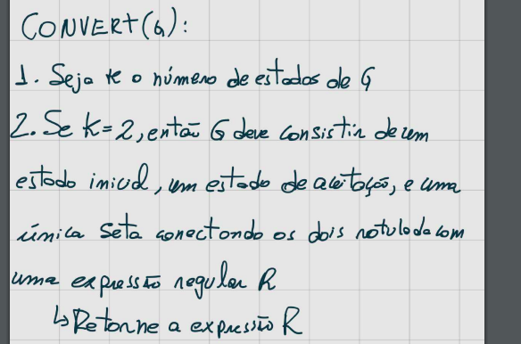

# Regex

## Equivalência REGEX com AF

    Uma linguagem é regular se e somente se alguma expressão regular a descreve.

    Se uma linguagem é descrita por uma expressão regular, então ela é regular.

### Passos

### Autômoto Finito não determinístico e generalizado (AFNG)

    O estado inicial tem setas de transição saindo para todos os outros estados, mas nenhuma seta chegando de qualquer outro estado.

    Existe apenas 1 estado de aceitação, e ele tem setas chegando de todos os outros estados, mas nenhum saindo. O estado de aceitação NÃO é o mesmo que o inicial.

    Com exceção dos estados incial e de aceitação, uma seta sai de cada estado para todos os outros e também de cada estado para ele mesmo.

    Não precisamos aceitar somente simbolos agora, mas podemos aceitar experssões regulares mais complexas

    Para converter um AFD para um AFNG adicionando um novo estado inicial e um novo estado de aceitação e setas adicionais conforme necessário. Usamos o procedimento CONVERT(G) que toma um AFNG como entrada e retorna uma expressão regular equivalente.

